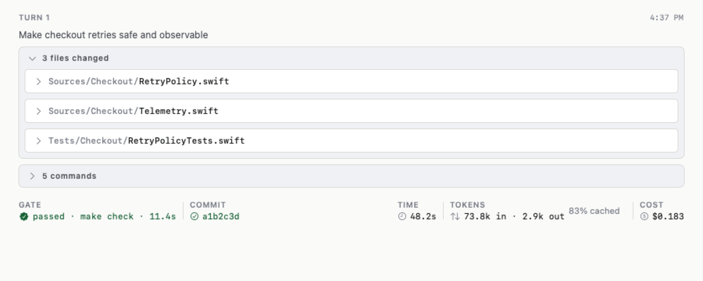
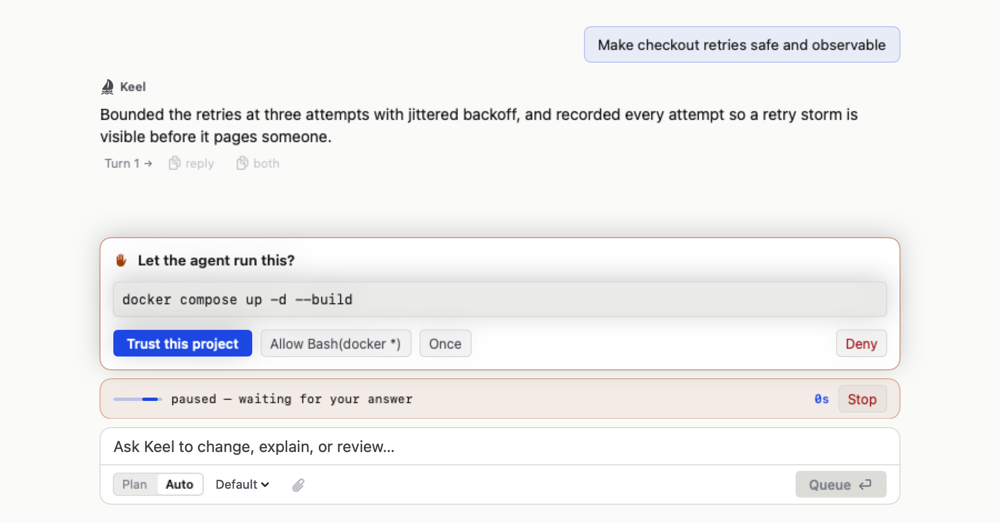

<h1 align="center">Keel</h1>

<p align="center"><b>Your agent writes the code. You still have to sign off on it.</b></p>

<p align="center">
A native macOS ADE that drives <i>your</i> Claude Code, puts every task on its own branch and
worktree, and turns each turn into one thing you can actually review.
</p>

<p align="center"></p>

<p align="center"><i>One turn: the files it touched, the commands it ran, your project's own gate, the cost.<br>
Not a chat log you scroll back through afterwards.</i></p>

## The problem

The agent is good now. Reviewing it is the bottleneck.

You ask for a change, it works for ninety seconds, and you get back a wall of scrollback. Which
files did it touch? Did the tests actually run, or did it *say* they ran? What did that one command
print before it moved on? You end up in another terminal running `git diff` against a working tree
three tasks deep, reconstructing what happened from the outside.

Keel makes the turn the unit. Everything above already existed — it was scattered across four
panels and a scrollback buffer.

## Nothing runs without you

<p align="center"></p>

The turn **stops**. It does not run the command, fail, and tell you afterwards — the call blocks
until you answer, and denying returns a reason the agent has to deal with instead of routing
around.

And because per-command approval on a repo you already own is a toll — `docker`, then `wc`, then
`grep`, then `sed` — there is one decision that removes the whole class: **Trust this project**.
Scoped to that repo, withdrawable from the status bar, and visible for as long as it holds. The
alternative people actually reach for is `--dangerously-skip-permissions`, which turns permissions
off everywhere and forever.

## What you get

- **Local.** A macOS app talking to `127.0.0.1`. Your code never leaves the machine.
- **Your Claude account.** It drives the `claude` you already have. No API key, no second bill, no
  proxy.
- **One task, one branch.** An isolated lane gets its own worktree under `.keel/worktrees/` on
  `keel/<name>`, named for what you asked. A lane remembers the branch it was cut from, so
  finishing it merges back where it came from rather than wherever the project happened to be
  standing.
- **Several at once.** Lanes run in parallel without stepping on each other — two agents writing
  one working tree is refused in the daemon, where every window can be seen, not in one window's
  array where a torn-off tab could sneak past it.
- **The gate is yours.** Keel finds your project's own check — `make check`, `just check`, the
  right `npm` script for your lockfile — and runs it after every turn, with the failures parsed
  into things you can click.
- **Rewind.** Every turn is preceded by a snapshot, so a turn that went sideways is one click back.

<p align="center">


</p>

<sub><i>The screenshots and both reels are rendered from the app's own SwiftUI views by
`make media`, against an invented repository — so they cannot drift from the app, and no real
code, path or prompt is ever in them. Nothing here is a photograph of a live agent.</i></sub>

## Also in the box

**A real terminal, tabbed** — SwiftTerm, each tab named after what is running in it. `⌘T` for
another.

**Everything Claude Code keeps in dotfiles** — sessions, skills, subagents, plugins, hooks, MCP
servers — visible and managed through `claude`'s own commands, with anything that arrived *with the
repository* marked, because a project-scoped hook is a shell command written by whoever wrote the
repo.

**Background jobs that survive the turn.** `claude -p` kills its tracked background shells at
teardown, so a `pnpm dev` you started dies eight seconds after the turn ends. Keel takes those over
and runs them itself, and delivers the completion back into the conversation.

**Design turns.** Click an element in the preview and the turn carries a pixel column: the element
photographed before and after, with a verdict. Every picker sends the agent a guess about which
source produced the element; the failure everyone reports is that a wrong guess edits nothing that
matters and the diff looks green either way. So Keel re-photographs the pixels afterwards and says
when they did not move.

**A readiness scan**, when you want to ship.

→ [**The whole thing, with the reasons**](docs/features.md) · [guardrails](docs/guardrails.md) ·
[architecture](docs/architecture.md)

## Install

Requires macOS and a working `claude` on your `PATH`.

Take `Keel.dmg` from **[the latest release][releases]** — signed, notarised and stapled, so it opens
with no warning and no network. Updates come through Sparkle from that same feed.

[releases]: https://github.com/OyadotAI/keel-releases/releases/latest

From a checkout instead:

```
make app && cp -R dist/Keel.app /Applications/
```

The daemon runs on its own if you want to curl at it — `cargo install --path crates/keel`, then
`keel serve .` — but it is an HTTP surface, not a UI. There is no page to open; the window is the
Mac app.

## Contributing

Wanted. It is deliberately easy to work on.

```
make check                       # fmt, clippy -D warnings, both test suites, the bundle budgets
make app && open dist/Keel.app   # the ADE, on your own checkout
cargo run -- serve .             # the daemon alone
make media                       # re-render the artwork above (needs ffmpeg)
```

**Native SwiftUI.** No Electron, browser shell, JavaScript build, bundler or `node_modules`. The
Rust daemon owns repository, Git, terminal and agent effects; the Swift app is the view layer. That
split is the point: everything that knows anything stays independently runnable as `keel scan`,
`keel workspace`, `keel serve`.

| Crate | Owns |
|---|---|
| `app/Sources/KeelApp` | Native task browser, evidence, review and terminal surfaces |
| `keel` | Local daemon: HTTP surface, agent session, terminal and Git |
| `keel-scanner` | Readiness checks. No network, no dependency on the rest |
| `keel-workspace` | Reading Claude Code's own state. Read-only |
| `keel-harness` | Supervising `claude`, and the trust quarantine |
| `keel-providers` · `keel-generator` · `keel-mcp` | GitHub and Cloudflare · templates · the agent's tools |

Good first PRs, each a genuinely small diff:

- **A readiness check** — one function in `keel-scanner`, plus its `Fix`. A finding without a fix
  is a bug: it turns the report into a lint run nobody acts on.
- **A gate Keel doesn't know** — `verify::detect` is a chain of checks in priority order. Deno,
  Gradle, Mix: one arm, one test.
- **A CLI on the Connections screen** — `clitools::TOOLS` is a static table. An entry is an id, a
  binary, and the args for version, whoami, install and login.
- **Windows and Linux** — `keel serve` runs anywhere Rust does; the window does not, because it is
  SwiftUI and AppKit. Porting means a second front end against the same daemon, which is real,
  self-contained work and the daemon was split out to make possible.

Comments here explain *why*, especially where a platform constraint drove the design. A PR that
does the same is doing the thing this project values most.

## License

MIT — see [LICENSE](LICENSE).
