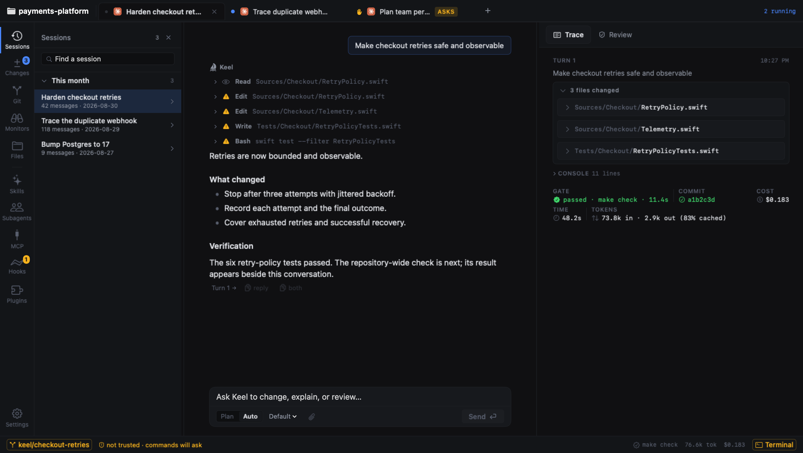
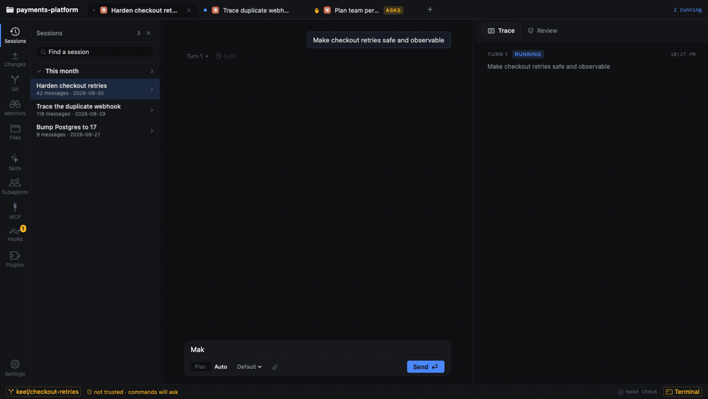
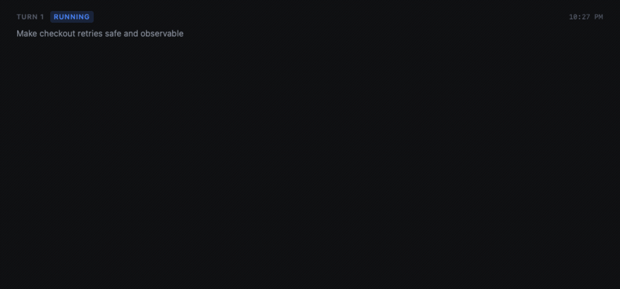
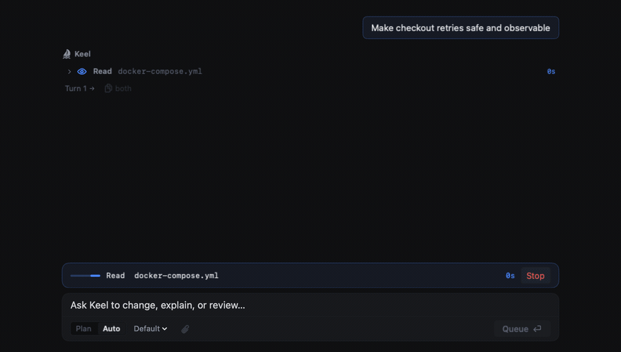
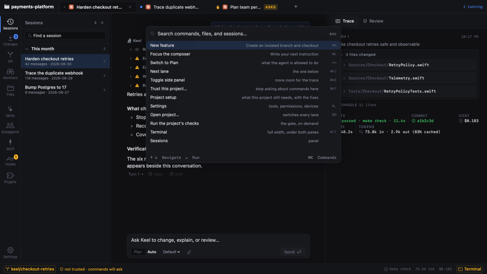
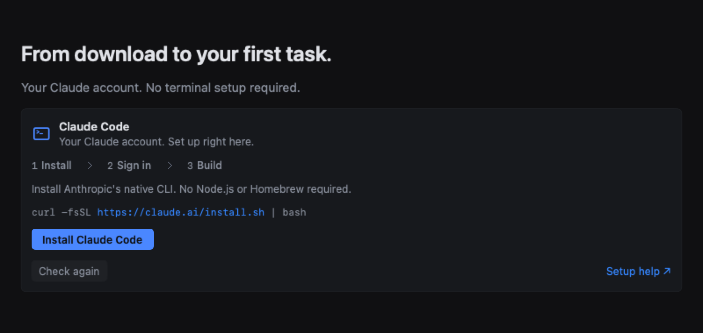
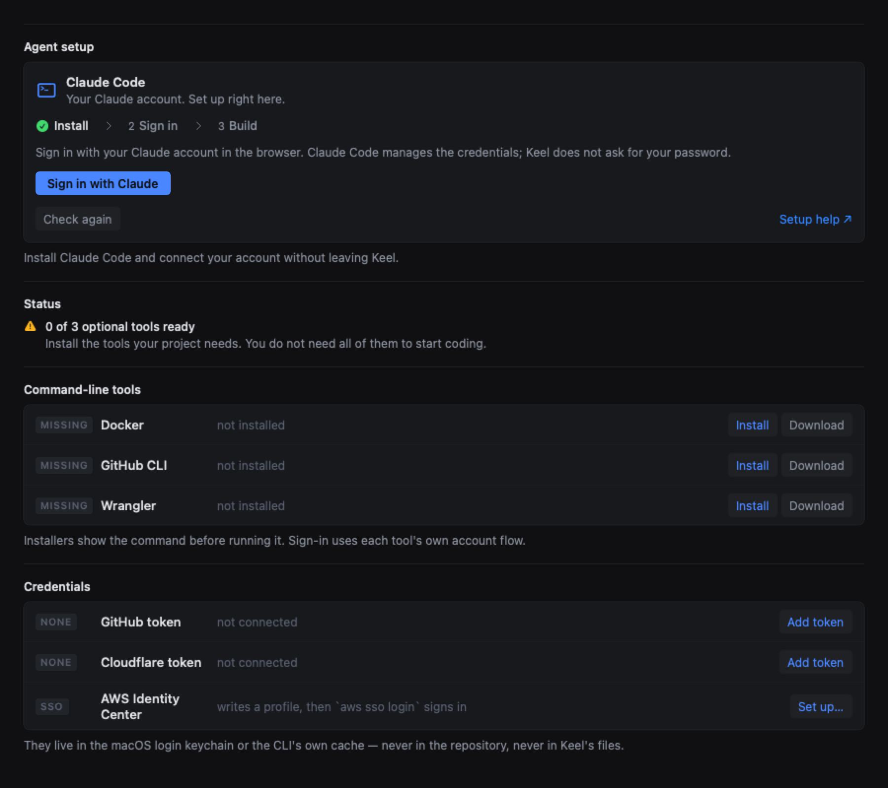

<h1 align="center">Keel</h1>

<p align="center">
  <b>Love Claude Code. Hate the CLI and VS Code extension experience?<br>This is for you.</b>
</p>

<p align="center">
  <b>The native macOS ADE (Agentic Development Environment) for product engineers.</b><br>
  Your Claude account. Isolated Git worktrees. Live stacked diffs. Zero terminal scrollback.
</p>

<p align="center">
  <a href="https://github.com/OyadotAI/keel/releases/latest"></a>
  <a href="https://github.com/OyadotAI/keel/blob/main/LICENSE"></a>
  <a href="https://getoya.ai"></a>
  <a href="https://github.com/OyadotAI/keel-releases/releases/latest"></a>
</p>

<p align="center"><b>Free. Open source. Always.</b><br>
Used daily by engineers at Oya.ai and Jumpermedia.co.</p>

<p align="center">Sponsored by <a href="https://getoya.ai">getOya.ai</a>, a runtime for accurate agents.</p>

<p align="center">
  <a href="https://github.com/OyadotAI/keel-releases/releases/latest"><b>Download for macOS</b></a>
  · <a href="#see-it-in-action">Watch the demo</a>
  · <a href="#why-engineers-switch-from-cli--vs-code">Why switch</a>
  · <a href="#get-started">Get started</a>
  · <a href="#roadmap">Roadmap</a>
  · <a href="docs/launch.md">Share kit</a>
</p>

<p align="center">
  <a href="#see-it-in-action">
    
  </a>
</p>

---

### Keep the agent you love. Change the experience around it.

Claude Code is one of the most capable coding agents ever built. But driving it through a raw terminal or VS Code extension feels like driving a sports car through a keyhole:

- **Walls of terminal scrollback.** A 90-second run buries what the agent actually changed under thousands of lines of output.
- **Single-branch collisions.** Trying to run two agents at once wrecks your working tree.
- **Background servers that die.** Start `pnpm dev` or `gh run watch` in the agent shell? It gets killed 8 seconds after the turn ends.
- **Blind approvals.** Terminal approval prompts roll past or tempt you into running `--dangerously-skip-permissions`.
- **Reinventing verification.** The agent *says* tests passed. Did they?

**Keel makes the turn the unit.** Every file touched, every command run with its output, your project's real verification gate, duration, and cost—rendered into one clean, reviewable artifact.

Your existing Claude sessions come with you. Running one in your terminal right now? Follow its activity live in Keel.

---

## Why engineers switch from CLI & VS Code

| Experience | Raw CLI / VS Code Extension | Keel Native ADE |
| :--- | :--- | :--- |
| **Reviewing code** | `git diff` after the turn, scrolling through terminal logs | **Live stacked diffs** with syntax highlighting as files are written |
| **Multi-agent concurrency** | One shared branch; simultaneous tasks collide and clobber files | **Isolated Git worktrees** (`.keel/worktrees/`) on dedicated task branches |
| **Background jobs** | Dev servers (`pnpm dev`) killed on turn exit | **Monitors**: daemon supervises background jobs with streaming logs & Stop button |
| **Command approvals** | Prompts lost in scrollback; all-or-nothing permission flags | **Inline approval cards**: Allow Once, Allow Session, or 1-click **Trust this project** |
| **Verification** | Trusting the agent's prose or running checks by hand | **Automatic gates**: Keel runs your real `make check`, `cargo test`, or `pnpm test` |
| **Existing history** | Locked inside terminal history; no unified view | **Replay & Follow**: browse past sessions and watch external runs in real time |
| **UI verification** | Guessing files, accidental component duplication | **Visual canvas & pixel check**: inspect DOM elements and verify pixels before/after |
| **Speed & ergonomics** | Heavy webview wrappers or terminal panes | **100% Native**: Swift & AppKit frontend + local Rust daemon. Zero Electron |

---

## See it in action

Watch three tasks progress concurrently across isolated Git branches, with live diffs and gate verification:

<p align="center"></p>

---

## Core Superpowers

### 1. The turn is the reviewable artifact
An agent reporting "done" is an assertion. Keel collects every file written, every command with its raw output, the repository's real gate verdict, commit hash, duration, tokens, and cost into one inspectable packet.

<p align="center"></p>

- **Parallel work, separate branches.** Every task lane can spin up its own Git worktree under `.keel/worktrees/<lane>` on branch `keel/<lane>`. Tear a tab into its own window without losing its checkout.
- **Checks you recognize.** Keel detects your project's gate (`make check`, `cargo test`, `npm test`, `pytest`) and runs it after every turn. No invented green checkmarks.
- **Rewind with safe undo.** Restore a pre-turn snapshot without blowing away your staged changes. Conflicting ignored files halt the operation safely.

### 2. Approve commands in the flow
When the agent needs permission to run a command, it **stops** right above your composer with the exact command line and intent.

<p align="center"></p>

- **Allow once** runs the single invocation and remembers nothing.
- **Session & project rules** grant scoped patterns under More options.
- **Trust this project** eliminates repetitive permission tolls for repos you own. Visible in the status bar, withdrawable anytime.

### 3. Your old sessions. Your live agents. One workspace.
**You don't have to start a session in Keel to see it in Keel.**

- **Zero-migration history.** Browse and replay past Claude Code conversations directly from `~/.claude/projects/`—no import scripts or cloud accounts needed.
- **Follow work in real time.** Launch `claude` in your terminal, VS Code, or Orca. Keel's watcher picks up the active transcript and streams messages, tool calls, and diffs live.
- **Deep write recovery.** Recovers files written not just by `Edit`/`Write`, but by subagents (`Task`) and shell commands (`cat >>`, python heredocs), flagging edits outside the repo.

### 4. Background jobs that don't die
In the Claude Code CLI, background processes (`run_in_background`) get terminated the moment the turn completes. Keel's daemon takes them over:

- **Monitors panel:** Long-running processes like `pnpm dev` or `gh run watch` run supervised outside turn lifetimes.
- **Live streaming output:** Inspect stdout/stderr in real time and stop jobs with a single click.
- **Automatic completion turn:** When a background job finishes, its status arrives back into your conversation as a clean turn report.

### 5. Visual design turns & pixel verification
Building frontends with agents often results in edited-the-wrong-file or duplicated-component bugs:

- **Point-and-click inspection:** Click any UI element in the web preview to feed Claude exact CSS selectors, bounding boxes, and computed styles.
- **Pixel verification:** Re-photographs elements before and after the turn to prove the pixels actually changed where you asked.

### 6. Built for keyboard speed
Never take your hands off the keyboard. Press `⌘K` to search actions, files, and conversations.

<p align="center"></p>

| Shortcut | Action | Shortcut | Action |
| :--- | :--- | :--- | :--- |
| `⌘K` | Command palette | `⌘L` | Focus composer |
| `⌘Return` | Send turn instruction | `⇧Tab` | Toggle Plan / Auto mode |
| `⌘.` | Stop active turn | `⌘N` | New task lane |
| `⌘1`–`⌘9` | Switch task lane 1–9 | `⌘⇧[` / `⌘⇧]` | Previous / next task lane |
| `⌘⇧A` | Allow oldest command once | `⌘⇧D` | Deny oldest command |
| `⌘⇧T` | Trust this project | `⌘⇧E` | Toggle side panel (diffs / trace) |
| `⌘⌥T` | Toggle integrated terminal | `⌘O` | Open repository |
| `⌘,` | Tools & settings | `@` / `/` | Attach files / Claude slash commands |

---

## Why I built Keel

> I loved Claude Code's agent. Making it work well for a team was the frustrating part.
>
> - **Everyone had a different setup.** Getting the same skills, plugins, hooks, and tools onto every teammate's machine meant chasing missing pieces instead of building the product.
> - **I couldn't see the work clearly.** What were my agents doing? Which files did this session modify? I wanted that answer in the workspace, not buried in terminal output.
> - **I wanted shared workflows, not a subscription migration.** I wanted teammates to keep their individual Claude subscriptions, including Max, while working from the same playbook.
>
> That's the reason for Keel: an opinionated environment around Claude for people who build products. Make setup visible. Keep decisions close to the conversation. Make the agent's work inspectable.
>
> — **Mohamed Alkiswani**, Creator of Keel

---

<a id="get-started"></a>

## Get started in 60 seconds

1. **Download Keel.** Grab the latest [Keel.dmg release][releases], or build from source below.
2. **Connect Claude.** Already signed in? Keel detects your setup instantly. Otherwise, click **Install Claude Code** and **Sign in with Claude** via Anthropic's official browser flow.
3. **Open any repository.** Start a new feature lane, inspect past sessions, or follow an active terminal agent.

<p align="center"></p>

Requires **macOS 15+** and an [account with Claude Code access](https://code.claude.com/docs/en/setup#authenticate).  
No Node.js or Homebrew required to install Claude Code. Keel uses Anthropic's official native installer and CLI browser-login flow. No separate Keel account or proxy.

**Need dev tools?** Open **Tools & settings** (`⌘,`) for one-click setup of GitHub CLI, Cloudflare Wrangler, Docker, Kubernetes, Google Cloud, AWS, and Tailscale.

<details>
<summary><b>Inspect developer tool installers</b></summary>
<p></p>
</details>

[releases]: https://github.com/OyadotAI/keel-releases/releases/latest

---

## Local & Private by Design

- **Local by default.** The native macOS app connects to its Rust daemon over `127.0.0.1`. Optional paired-device access can expose the daemon over LAN or Tailscale; keep loopback mode unless you need it.
- **Your credentials stay yours.** Keel uses your existing Claude authentication. Prompts and code go directly to Anthropic per your account terms—never to third-party intermediate proxies.
- **Deterministic locks:** File system and checkout locks prevent multiple agents from clobbering your Git state.
- **Reporting is configurable.** Official builds can send crash reports to Sentry and usage events to PostHog. Both are enabled by default when configured; turn either off in **Settings → Privacy**. Builds without reporting keys leave those SDKs off. See [Privacy](docs/privacy.md) for the data flows and limits.
- **Trust stays on your Mac.** Project trust and approved commands are saved outside the repository. Cloned permission files are ignored; build and installer commands are suggestions until you approve them.
- Learn more in the [Guardrails & Limits Guide](docs/guardrails.md).

---

## Build from Source

Keel is written in **Swift (AppKit + SwiftUI)** for the front end and **Rust** for the daemon. Zero Electron, zero webview wrappers.

```sh
# Clone repository
git clone https://github.com/OyadotAI/keel.git && cd keel

# Run the complete test gate
make check

# Build & launch the native app
make app
open dist/Keel.app
```

The Rust daemon can also run independently:
```sh
cargo run -- serve .
```

### Repository Layout

| Subsystem | Location | Role |
| :--- | :--- | :--- |
| **App** | `app/Sources/KeelApp` | Native task tabs, diff view, review cards, SwiftTerm terminal |
| **Daemon** | `crates/keel` | HTTP daemon, agent supervisor, Git worktree engine, monitors |
| **Scanner** | `crates/keel-scanner` | Repository readiness checks (`keel scan`) |
| **Workspace** | `crates/keel-workspace` | Reads Claude Code sessions, skills, plugins, and hooks |
| **Harness** | `crates/keel-harness` | Claude process supervision and untrusted config quarantine |
| **Providers** | `crates/keel-providers` | Cloudflare and GitHub integrations |
| **Generator** | `crates/keel-generator` | Production stack templates and golden-path scaffolds |
| **MCP** | `crates/keel-mcp` | Tool surface and Model Context Protocol catalog |

---

## Roadmap

- [ ] **Interactive Designer View** — Live preview window showing agent UI updates in real time, with visual drag-and-drop manipulation and direct UI editing that translates changes back into structured agent instructions.
- [ ] **Codex Support** — Native integration and workspace support for OpenAI Codex agents alongside Claude Code.
- [ ] **Windows Support** — Native Windows desktop support and daemon integration for Windows developer workflows.
- [ ] **Linux Support** — Linux desktop and environment support for engineers running Linux workstations.
- [ ] **OpenCode Support** — Full compatibility and runtime integration with OpenCode.

---

## Contributing

Keel is free and open source, and will always be free to use. Contributions of all kinds are welcome!

- Check out the [Contribution Guide](CONTRIBUTING.md) for setup rules and testing.
- See open issues on the [Issue Tracker](https://github.com/OyadotAI/keel/issues).
- Review our [Code of Conduct](CODE_OF_CONDUCT.md), [Support Guide](SUPPORT.md), and [Security Policy](SECURITY.md).

---

## Maintainer and Sponsor

Keel is created and maintained by **Mohamed Alkiswani** ([mk@getoya.ai](mailto:mk@getoya.ai)) and sponsored by **[getOya.ai](https://getoya.ai)**, a runtime for accurate agents.

## License

MIT — see [LICENSE](LICENSE).
