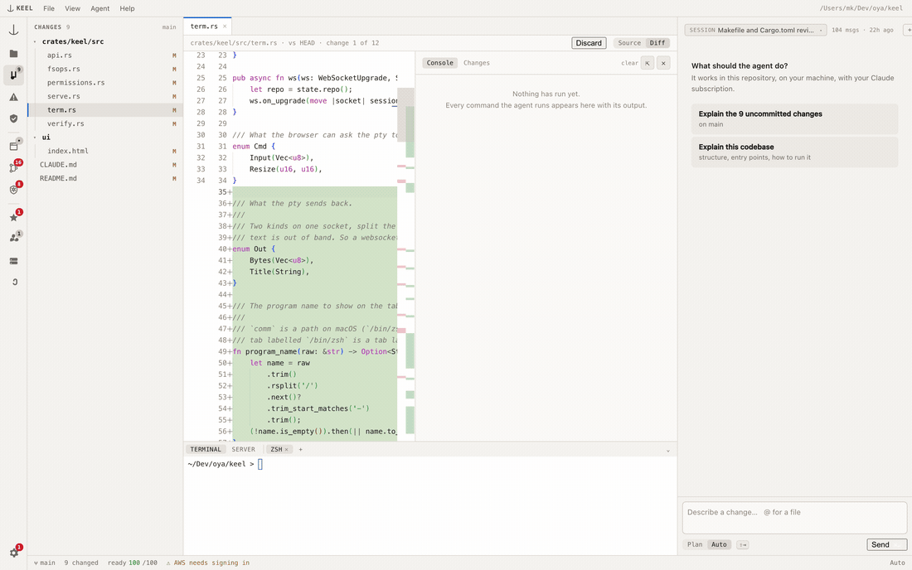
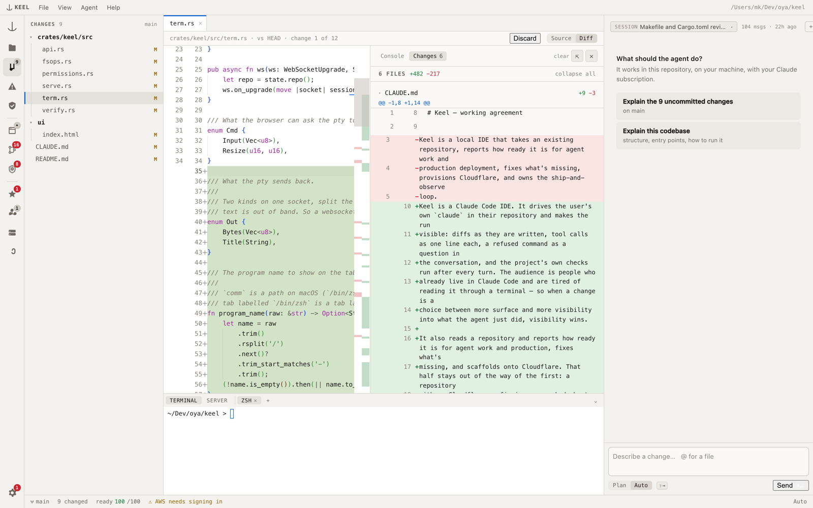
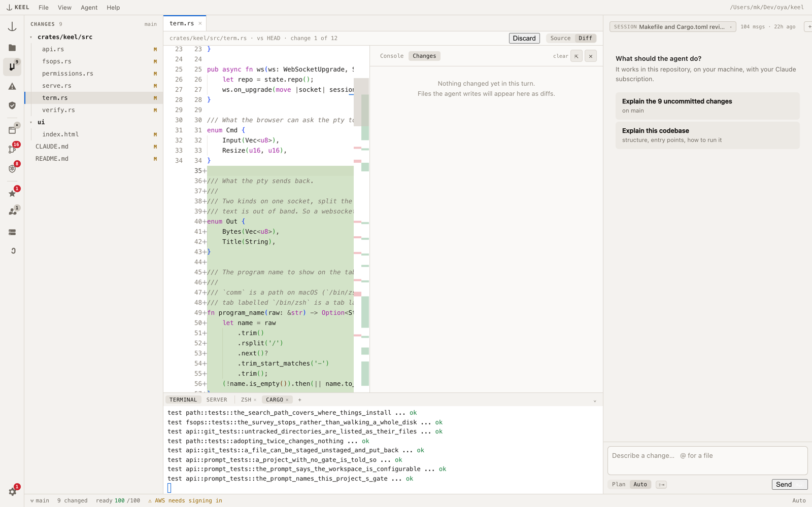
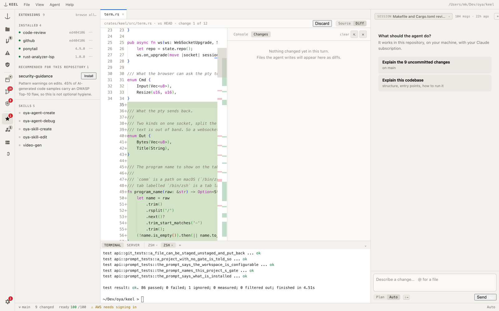

<h1 align="center">Keel</h1>

<p align="center"><b>Cursor, but for Claude Code.</b></p>

<p align="center">
An open-source desktop IDE that runs <i>your</i> Claude Code, locally, on your existing
subscription — and shows you every file it changed, every command it ran, and whether the tests
still pass.
</p>

<p align="center">

</p>

- **Local.** A macOS app talking to `127.0.0.1`. Your code never leaves the machine.
- **Your Claude account.** It drives the `claude` you already have, so your subscription covers the
  agent. No API key, no second bill, no proxy.
- **Nothing hidden.** Diffs while they are written, every tool call with its output, a refused
  command as a question you click, and the project's own checks run after every turn.

```
Cursor, but for Claude Code — open source, local, your own Claude subscription.
```

## Install

```
git clone <this repo> && cd keel
make app && cp -R dist/Keel.app /Applications/
```

Or grab `Keel.dmg` from a release — signed, notarised and stapled, so it opens with no warning and
no network. CLI only: `cargo install --path crates/keel`, then `keel serve .`

## The tour

<p align="center">

</p>

**Every file a turn touched, in one screen** — stacked diffs, live, instead of `git diff`
afterwards. Reopen a session from last week and the same panel fills from its transcript: what it
changed, and every command it ran with the output it got.



**A real terminal, tabbed** — each tab named after what is running in it, so you can tell which one
is the build you are waiting on. `⌘T` for another.



**Everything Claude Code keeps in dotfiles** — sessions, skills, subagents, plugins, hooks, MCP
servers — visible and managed through `claude`'s own commands, with anything that arrived *with the
repository* marked, because a project-scoped hook was written by whoever wrote the repo.



Also: approvals answered in the conversation instead of a prompt that scrolled past, the project's
own gate run after every turn with the failures parsed into clickable problems, a preview that can
hold a login, and a readiness scan when you want to ship.

→ [**The whole thing, with the reasons**](docs/features.md) · [guardrails](docs/guardrails.md) ·
[architecture](docs/architecture.md)

## Contributing

Wanted. It is deliberately easy to work on.

```
make check                # fmt, clippy -D warnings, tests — the whole gate, ~5s
cargo run -- serve .      # the IDE, on your own checkout
```

**No JavaScript build.** No bundler, no `node_modules`, no watch process. The UI is one HTML file —
`ui/index.html` — compiled in with `include_str!`. Edit, rebuild, reload.

| Crate | Owns |
|---|---|
| `keel` | The app: HTTP surface, agent session, terminal, git, UI |
| `keel-scanner` | Readiness checks. No network, no dependency on the rest |
| `keel-workspace` | Reading Claude Code's own state. Read-only |
| `keel-harness` | Supervising `claude`, and the trust quarantine |
| `keel-providers` · `keel-generator` · `keel-mcp` | GitHub and Cloudflare · templates · the agent's tools |

Good first PRs, each a genuinely small diff:

- **A readiness check** — one function in `keel-scanner`, plus its `Fix`. A finding without a fix is
  a bug: it turns the report into a lint run nobody acts on.
- **A gate Keel doesn't know** — `verify::detect` is match arms in priority order. Deno, Gradle,
  Mix: one arm, one test.
- **A CLI on the Connections screen** — `clitools::TOOLS` is a static table. An entry is an id, a
  binary, and the args for version, whoami, install and login.
- **Windows and Linux** — `keel serve` runs anywhere Rust does, and the window is `tao` + `wry`,
  which build everywhere; only macOS has ever been tried. Running it elsewhere and fixing what
  falls over is real, self-contained work.

The UI has tests too: `cargo test` fails if the page's script does not parse (a syntax error blanks
the whole page — that shipped once), if a CSS variable is undefined, if a function is declared
twice, or if a control is invisible until hovered. `make ui` renders every panel headlessly and
prints what came out.

Comments here explain *why*, especially where a platform constraint drove the design. A PR that
does the same is doing the thing this project values most.

## License

Apache-2.0
